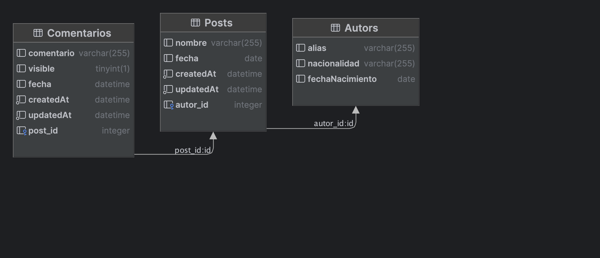

# Ejercicio Báico

Este es un ejercicio básico que convina express con sequielize y las relaciones uno a muchos (1..N). También se hace una presentacion sobre las validaciones de schema y los middlewares para realizar validaciones.

## Base de datos 
Es ejemplo utiliza una base de datos sqlite que nos permite persistir la informacion para hacer prubeas siemple. Con pequeños cambis en la configuracion se puede utilizar con otros motores de base de datos como pueden ser mysql o postgres.

## Modelo de datos
El modelo de datos que usa es muy simple. Hay 3 tablas
- Autors
- Posts
- Comentarios

Las realciones son
- Un Autor puede tener publicados muchos Post y un Post solo puede ser realizado por un Autor.
- Un Post puede tener muchos comentarios reealizados y un Comnetario solo puede pertenecer a un Post



## Lanzar la aplicacion
Para lanzar la aplicacion, lo primero que hay que hacer es instalar las dependcias del proyecto. En particular este proyecto utiliza.
```
"dependencies": {
    "express": "^4.19.2",
    "express-async-errors": "^3.1.1",
    "joi": "^17.13.0",
    "sequelize": "^6.37.3",
    "sqlite3": "^5.1.7"
  },
  "devDependencies": {
    "nodemon": "^3.1.0",
    "sequelize-cli": "^6.6.2"
  }
```
Para instalar las dependencias en el proyecto deben correr el siguiente comnado 

```npm install```

A continuación, se puede lanzar la aplicacion. Por defecto la aplicación se inicia en el puerto 3000 pero se puede cambiar a otro valor siemplemente configurando la variable de entorno PORT en su sistema operativo. 
Correr el comando

 ```npm run dev```

En el entorno de desarrollo la aplicacion carga algunos registros fake para que puedan realizar algunas prubas con los datos para entener el endpoinds.

## Endpoints disponibles
|verbo|endpoint|descripcion|
|-----|--------|-----------|
|GET|/autor|Recupera la lista de autores registrados|
|GET|/autor/:id|Recupera un autor en particular con los post publicado él|
|POST|/autor|Crea un nuevo Autor|
|POST|/autor/:id/post|Crea un nuevo post que pertence al :id del autor|
|GET|/post|Recupera la lista de los Post registrados|
|GET|/post/:id|Recupera un Post en particular con todos los comentarios que le hayan realizado|
|POST|/post|Crea un nuevo Post|
|POST|/post/:id/comentario|Crea un nuevo comentario que pertecel al :id del post|

## cURL para
- Crear un autor

```
curl --location 'http://localhost:3000/autor' \
--header 'Content-Type: application/json' \
--data '{
    "alias": "blackJack",
    "nacionalidad": "ARG",
    "fechaNacimiento": "1975-08-11"
}'
```

- Crea un nuevo post que pertence al :id del autor

```
curl --location 'http://localhost:3000/autor/2/post' \
--header 'Content-Type: application/json' \
--data '{
    "nombre": "Trabajo Practico",
    "fecha": "2023-12-24"
}'
```

- Crea un nuevo Post

```
curl --location 'http://localhost:3000/post' \
--header 'Content-Type: application/json' \
--data '{
    "nombre": "Trabajo Practico 2",
    "fecha": "2023-12-24",
    "autor": {
        "id": 2
    }
}'
```

- Crea un nuevo comentario que pertecel al :id del post

```
curl --location 'http://localhost:3000/post/1/comentario' \
--header 'Content-Type: application/json' \
--data '{

    "nombre": "Trabajo Practico",
    "fecha": "2023-12-24"
}'
```

## Importar cURL a Postman de forma rapida
Ejemplo de como agregar un cURL a Postman
